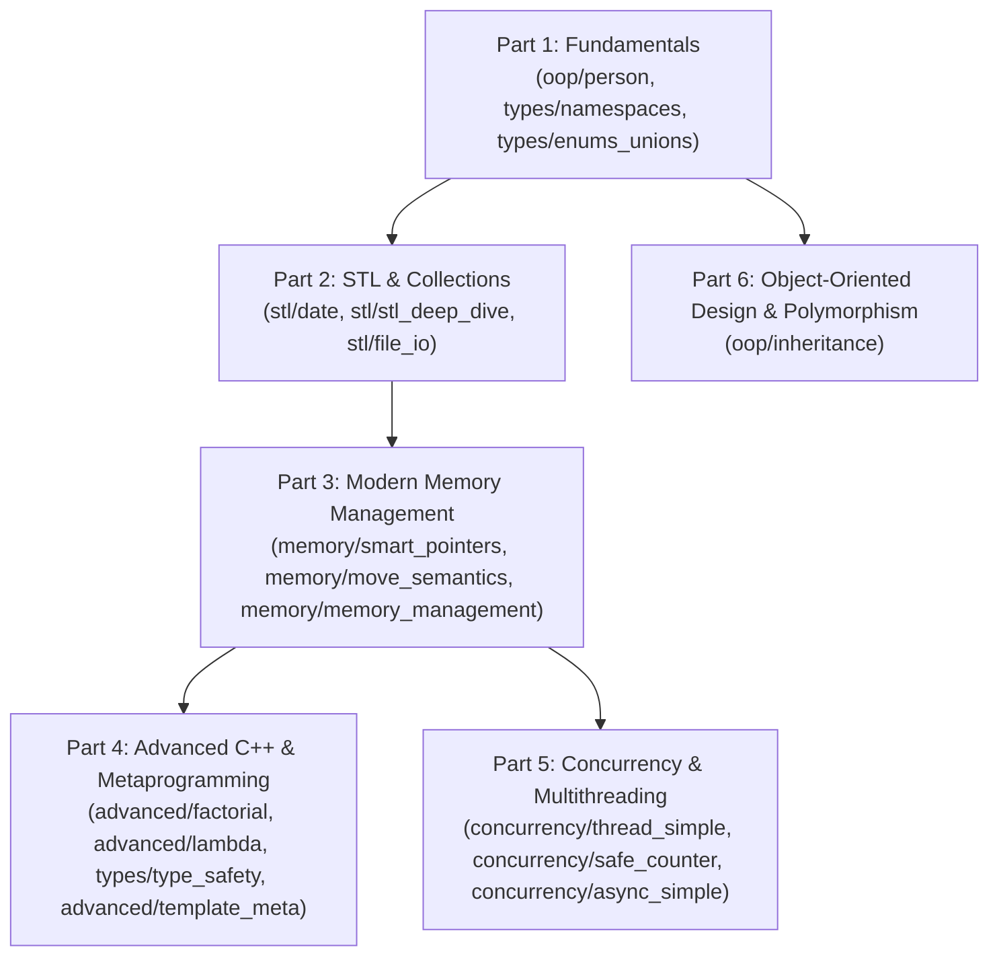

# C++ Trial Lessons

This document serves as the high-level curriculum roadmap for this repository. It guides developers progressively through modern C++ features (C++11 through C++20), systems programming patterns, and backend design principles.

For module-level architectures, complete code snippets, and in-depth guides, see the [Source Directory Guide (`src/README.md`)](src/README.md) and each module's dedicated README.

---

## Target Audience & Learning Philosophy

### Who This Repository Is For
This curriculum is designed for **software developers who already understand programming fundamentals** (such as variables, functions, control flow, and basic OOP from languages like Python, Java, Go, TypeScript, Rust, or legacy C) and want to master **idiomatic Modern C++ (C++17 / C++20)** as used in production backend and systems engineering.

> [!IMPORTANT]
> **This is NOT an introduction to coding from scratch.**
> If you have never programmed before, modern C++ will feel overwhelming because it prioritizes **explicit control over memory, lifetime, and types**. We intentionally avoid teaching naive "toy" patterns (such as raw `new`/`delete`, public mutable fields, or primitive obsession) in favor of production-grade practices from Day 1.

### The Modern C++ Mindset Shift
When coming from garbage-collected or dynamically-typed languages, C++ code often appears verbose. Every "advanced" syntax feature in this repository serves an explicit engineering goal:

| Concept in Other Languages | Modern C++ Equivalent | Why C++ Does It |
|---|---|---|
| Runtime parameter validation | Strong types (`Age`, `Salary`) | Catches invalid states and swapped arguments at compile time / construction |
| Garbage collection | RAII & Smart Pointers (`std::unique_ptr`) | Guarantees deterministic cleanup with zero runtime pause times |
| Heap-allocating `.toString()` | `std::formatter<T>` | Formats directly into output buffers without intermediate allocations |
| Magic sentinel values (`-1`, `null`) | `std::optional<T>` | Eliminates null pointer exceptions and forces explicit handling |
| Dynamic collections / streams | C++20 Ranges & Views | Composable, lazy stream processing with zero temporary heap allocations |

---

## Progressive Learning Path

The curriculum is structured into six progressive parts. Each section builds on concepts introduced in preceding modules:

---

## Part 1: Fundamentals

> [!NOTE]
> **Prerequisites**: General programming literacy (variables, functions, conditionals). No prior C++ required.
> **Core Focus**: Class encapsulation, namespace partitioning, and type-safe enumerations.

| Lesson | Focus & Concepts | Links |
|---|---|---|
| **[`oop/person`](src/oop/README.md#1-person--value-encapsulation-personh)** | Encapsulation, strong parameter types, custom formatting | [src](src/oop/person.h) · [test](test/oop/person_test.cpp) |
| **[`types/namespaces`](src/types/README.md#1-namespaces--scoping-namespacesh)** | Modular scoping, nested namespaces, aliases, header hygiene | [src](src/types/namespaces.h) · [test](test/types/namespaces_test.cpp) |
| **[`types/enums_unions`](src/types/README.md#2-enums-unions-and-stdvariant-enums_unionsh)** | Scoped enums, union memory layouts, type-safe variants | [src](src/types/enums_unions.h) · [test](test/types/enums_unions_test.cpp) |

---

## Part 2: STL & Collections

> [!NOTE]
> **Prerequisites**: Completion of Part 1.
> **Core Focus**: Contiguous memory containers, algorithms, and composable ranges pipelines.

| Lesson | Focus & Concepts | Links |
|---|---|---|
| **[`stl/date`](src/stl/README.md#1-date--three-way-comparison-dateh)** | Value semantics, three-way comparison, defaulted equality | [src](src/stl/date.h) · [test](test/stl/date_test.cpp) |
| **[`stl/stl_deep_dive`](src/stl/README.md#2-stl-deep-dive-containers-algorithms--ranges-stl_deep_diveh)** | Standard containers, constrained algorithms, lazy range views | [src](src/stl/stl_deep_dive.h) · [test](test/stl/stl_deep_dive_test.cpp) |
| **[`stl/file_io`](src/stl/README.md#3-file-inputoutput--filesystem-file_ioh)** | Stream buffer reading, line-based processing, filesystem paths | [src](src/stl/file_io.h) · [test](test/stl/file_io_test.cpp) |

---

## Part 3: Modern Memory Management

> [!IMPORTANT]
> **Prerequisites**: Completion of Parts 1 and 2.
> **Core Focus**: Deterministic resource ownership, zero-copy transfers, and custom allocation architectures.

| Lesson | Focus & Concepts | Links |
|---|---|---|
| **[`memory/smart_pointers`](src/memory/README.md#1-smart-pointers--custom-deleters-smart_pointersh)** | Unique/shared ownership, custom deleters, cycle breaking | [src](src/memory/smart_pointers.h) · [test](test/memory/smart_pointers_test.cpp) |
| **[`memory/move_semantics`](src/memory/README.md#2-move-semantics--perfect-forwarding-move_semanticsh)** | Value semantics, resource stealing, Rule of Five, perfect forwarding | [src](src/memory/move_semantics.h) · [test](test/memory/move_semantics_test.cpp) · [bench](bench/move_semantics_bench.cpp) |
| **[`memory/memory_management`](src/memory/README.md#3-custom-memory-management--allocation-patterns-memory_managementh)** | Arena allocators, memory pools, cache-line alignment, stack vectors | [src](src/memory/memory_management.h) · [test](test/memory/memory_management_test.cpp) · [bench](bench/memory_management_bench.cpp) |

---

## Part 4: Advanced C++ & Metaprogramming

> [!NOTE]
> **Prerequisites**: Completion of Part 3.
> **Core Focus**: Compile-time evaluation, type introspection, and zero-cost generic abstractions.

| Lesson | Focus & Concepts | Links |
|---|---|---|
| **[`advanced/factorial`](src/advanced/README.md#1-concepts--function-templates-factorialh)** | Constrained function templates, compile-time assertions | [src](src/advanced/factorial.h) · [test](test/advanced/factorial_test.cpp) |
| **[`advanced/lambda`](src/advanced/README.md#2-lambda-expressions--functional-programming-lambdah)** | Functional transformations, closures, capture semantics | [src](src/advanced/lambda.h) · [test](test/advanced/lambda_test.cpp) |
| **[`types/type_safety`](src/types/README.md#3-modern-type-safety-features-type_safetyh)** | Vocabulary types, non-allocating string views, structured bindings | [src](src/types/type_safety.h) · [test](test/types/type_safety_test.cpp) |
| **[`advanced/template_meta`](src/advanced/template_meta.h)** | Type traits, compile-time recursion, fold expressions, CRTP | [src](src/advanced/template_meta.h) · [test](test/advanced/template_meta_test.cpp) |

---

## Part 5: Concurrency & Multithreading

> [!IMPORTANT]
> **Prerequisites**: Completion of Part 3.
> **Core Focus**: Native OS thread management, race prevention, and asynchronous execution.

| Lesson | Focus & Concepts | Links |
|---|---|---|
| **[`concurrency/thread_simple`](src/concurrency/README.md#1-basic-thread-lifecycle-thread_simpleh)** | Thread lifecycle, join semantics, background workers | [src](src/concurrency/thread_simple.h) · [test](test/concurrency/thread_simple_test.cpp) |
| **[`concurrency/safe_counter`](src/concurrency/safe_counter.h)** | Critical section synchronization, RAII locks, atomic signaling | [src](src/concurrency/safe_counter.h) · [test](test/concurrency/safe_counter_test.cpp) · [bench](bench/concurrency_bench.cpp) |
| **[`concurrency/async_simple`](src/concurrency/async_simple.h)** | Asynchronous task offloading, non-blocking futures | [src](src/concurrency/async_simple.h) · [test](test/concurrency/async_simple_test.cpp) |

---

## Part 6: Object-Oriented Design & Polymorphism

> [!NOTE]
> **Prerequisites**: Completion of Part 1.
> **Core Focus**: Clean dynamic polymorphic hierarchies with zero object slicing or resource leaks.

| Lesson | Focus & Concepts | Links |
|---|---|---|
| **[`oop/inheritance`](src/oop/README.md#2-inheritance--runtime-polymorphism-inheritanceh)** | Abstract base classes, virtual destructors, dynamic dispatch | [src](src/oop/inheritance.h) · [test](test/oop/inheritance_test.cpp) |

---

## Overall Project Summary

| Domain | Key Tools & Practices Demonstrated | Engineering Takeaway |
|---|---|---|
| **Build & Toolchain** | CMake presets (`dev`/`release`), `clang-format`, `clang-tidy`, Address/UB sanitizers | Automated code hygiene, reproducible cross-platform builds, and proactive defect detection. |
| **Modern C++ Standards** | C++20 concepts, range pipelines (`std::views`), spaceship operator (`<=>`), structured bindings | Expressive, declarative syntax that compiles to optimal machine code with zero runtime overhead. |
| **Systems Engineering** | Deterministic RAII, zero-copy move semantics, custom arena/pool allocators, native OS threads | Predictable low-latency performance without garbage collection pauses or thread race conditions. |
