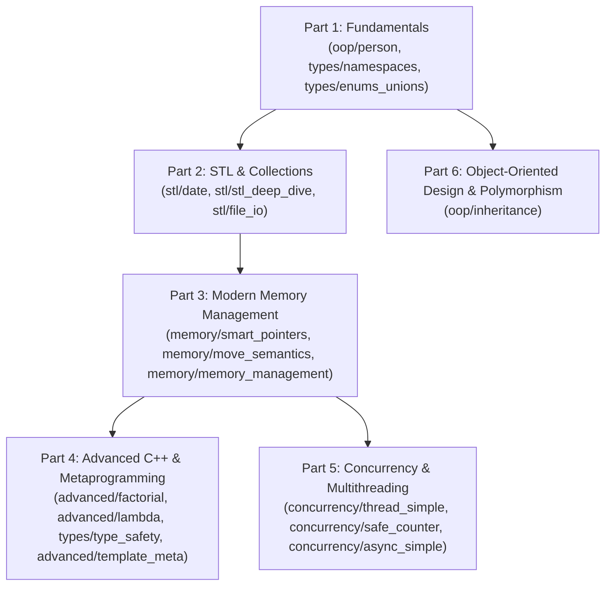

# C++ Lessons & Curriculum Roadmap

This document serves as the high-level learning roadmap for this repository. It guides developers progressively through modern C++ features (C++11 through C++20), systems programming patterns, and backend design principles.

For module-level architectures, code snippets, and in-depth guides, see the [Source Directory Guide (`src/README.md`)](src/README.md) and each module's dedicated README.

---

## Target Audience & Learning Philosophy

### Who This Repository Is For
This curriculum is designed for **software developers who already understand programming fundamentals** (such as variables, functions, control flow, and basic OOP from languages like Python, Java, Go, TypeScript, Rust, or legacy C) and want to master **idiomatic Modern C++ (C++17 / C++20)** as used in production backend and systems engineering.

> [!IMPORTANT]
> **This is NOT an introduction to coding from scratch.**
> If you have never programmed before, modern C++ will feel overwhelming because it prioritizes **explicit control over memory, lifetime, and types**. We intentionally avoid teaching naive "toy" patterns (such as raw `new`/`delete`, public mutable fields, or primitive obsession) in favor of production-grade practices from Day 1.

### The Modern C++ Mindset Shift
When coming from garbage-collected or dynamically-typed languages, C++ code often appears verbose. Every "advanced" syntax feature in this repository serves an explicit engineering goal:

| Concept in Other Languages | Modern C++ Equivalent | Why C++ Does It |
|---|---|---|
| Runtime parameter validation | Strong types (`Age`, `Salary`) | Catches invalid states and swapped arguments at compile time / construction |
| Garbage collection | RAII & Smart Pointers (`std::unique_ptr`) | Guarantees deterministic cleanup with zero runtime pause times |
| Heap-allocating `.toString()` | `std::formatter<T>` | Formats directly into output buffers without intermediate allocations |
| Magic sentinel values (`-1`, `null`) | `std::optional<T>` | Eliminates null pointer exceptions and forces explicit handling |
| Dynamic collections / streams | C++20 Ranges & Views | Composable, lazy stream processing with zero temporary heap allocations |

---

## Progressive Learning Path

The curriculum is structured into six progressive parts. Each section builds on concepts introduced in preceding modules:

---

## Part 1: Fundamentals

> [!NOTE]
> **Prerequisites**: Familiarity with basic programming concepts (types, functions, conditionals). No prior C++ knowledge required.
> **Goal**: Learn how C++ enforces class invariants, namespaces, and type-safe enumerations.

### 1. [oop/person](src/oop/README.md#1-person--value-encapsulation-personh)
- **Objective**: Replace primitive obsession with validated value types; implement encapsulation and zero-allocation formatting.
- **Key Concepts**: Validated value wrappers (`Age`, `Salary`), constructor validation, `std::formatter<Person>` specialization, C++20 range pipelines.
- **Files**: [src/oop/person.h](src/oop/person.h) | [src/oop/person.cpp](src/oop/person.cpp)
- **Unit Tests**: [test/oop/person_test.cpp](test/oop/person_test.cpp)
- **Detailed Guide**: [src/oop/README.md](src/oop/README.md)

### 2. [types/namespaces](src/types/README.md#1-namespaces--scoping-namespacesh)
- **Objective**: Prevent symbol collision in large-scale codebases through hierarchical namespaces and aliasing.
- **Key Concepts**: Nested namespaces (`utils::math`), namespace aliases, header file namespace hygiene.
- **Files**: [src/types/namespaces.h](src/types/namespaces.h) | [src/types/namespaces.cpp](src/types/namespaces.cpp)
- **Unit Tests**: [test/types/namespaces_test.cpp](test/types/namespaces_test.cpp)
- **Detailed Guide**: [src/types/README.md](src/types/README.md)

### 3. [types/enums_unions](src/types/README.md#2-enums-unions-and-stdvariant-enums_unionsh)
- **Objective**: Compare scoped and unscoped enums; understand raw union memory layouts versus type-safe alternatives.
- **Key Concepts**: Scoped enums (`enum class`), union shared memory, tagged unions, C++20 `using enum`, `std::variant`.
- **Files**: [src/types/enums_unions.h](src/types/enums_unions.h) | [src/types/enums_unions.cpp](src/types/enums_unions.cpp)
- **Unit Tests**: [test/types/enums_unions_test.cpp](test/types/enums_unions_test.cpp)
- **Detailed Guide**: [src/types/README.md](src/types/README.md)

---

## Part 2: STL & Collections

> [!NOTE]
> **Prerequisites**: Completion of Part 1. Understand value classes and standard formatting.
> **Goal**: Master standard library containers, modern algorithms, and C++20 ranges pipelines.

### 4. [stl/date](src/stl/README.md#1-date--three-way-comparison-dateh)
- **Objective**: Implement value semantics and comparison operator synthesis in C++20.
- **Key Concepts**: Three-way comparison operator (`operator<=>`), defaulted equality (`operator==`), `std::formatter<Date>`.
- **Files**: [src/stl/date.h](src/stl/date.h) | [src/stl/date.cpp](src/stl/date.cpp)
- **Unit Tests**: [test/stl/date_test.cpp](test/stl/date_test.cpp)
- **Detailed Guide**: [src/stl/README.md](src/stl/README.md)

### 5. [stl/stl_deep_dive](src/stl/README.md#2-stl-deep-dive-containers-algorithms--ranges-stl_deep_diveh)
- **Objective**: Leverage standard containers (`vector`, `map`, `set`), constrained algorithms, and C++20 views pipelines.
- **Key Concepts**: Lazy evaluation with `std::views::filter` and `std::views::transform`, pipe operator (`|`), `std::ranges::max_element`, `std::ranges::set_intersection`.
- **Files**: [src/stl/stl_deep_dive.h](src/stl/stl_deep_dive.h) | [src/stl/stl_deep_dive.cpp](src/stl/stl_deep_dive.cpp)
- **Unit Tests**: [test/stl/stl_deep_dive_test.cpp](test/stl/stl_deep_dive_test.cpp)
- **Detailed Guide**: [src/stl/README.md](src/stl/README.md)

### 6. [stl/file_io](src/stl/README.md#3-file-inputoutput--filesystem-file_ioh)
- **Objective**: Manage disk input/output deterministically with binary streams and filesystem abstractions.
- **Key Concepts**: `std::ifstream`, `std::ofstream`, stream buffer bulk iterators, line streaming, `std::filesystem::path`.
- **Files**: [src/stl/file_io.h](src/stl/file_io.h) | [src/stl/file_io.cpp](src/stl/file_io.cpp)
- **Unit Tests**: [test/stl/file_io_test.cpp](test/stl/file_io_test.cpp)
- **Detailed Guide**: [src/stl/README.md](src/stl/README.md)

---

## Part 3: Modern Memory Management

> [!IMPORTANT]
> **Prerequisites**: Completion of Parts 1 and 2.
> **Goal**: Replace garbage collection with deterministic RAII ownership, zero-copy move semantics, and cache-conscious allocation.

### 7. [memory/smart_pointers](src/memory/README.md#1-smart-pointers--custom-deleters-smart_pointersh)
- **Objective**: Eliminate memory leaks, manage resource ownership, and prevent circular dependencies.
- **Key Concepts**: `std::unique_ptr` with custom deleters (`FileDeleter`), `std::shared_ptr` reference counting, `std::weak_ptr` cycle breaking, Rule of Zero.
- **Files**: [src/memory/smart_pointers.h](src/memory/smart_pointers.h) | [src/memory/smart_pointers.cpp](src/memory/smart_pointers.cpp)
- **Unit Tests**: [test/memory/smart_pointers_test.cpp](test/memory/smart_pointers_test.cpp)
- **Detailed Guide**: [src/memory/README.md](src/memory/README.md)

### 8. [memory/move_semantics](src/memory/README.md#2-move-semantics--perfect-forwarding-move_semanticsh)
- **Objective**: Eliminate redundant heap allocations via resource stealing and perfect forwarding.
- **Key Concepts**: Rule of Five (`ResourceManager`), rvalue references (`&&`), `std::move`, perfect forwarding (`std::forward`), move-only types (`MoveOnlyType`).
- **Files**: [src/memory/move_semantics.h](src/memory/move_semantics.h) | [src/memory/move_semantics.cpp](src/memory/move_semantics.cpp)
- **Unit Tests**: [test/memory/move_semantics_test.cpp](test/memory/move_semantics_test.cpp)
- **Benchmarks**: [bench/move_semantics_bench.cpp](bench/move_semantics_bench.cpp)
- **Detailed Guide**: [src/memory/README.md](src/memory/README.md)

### 9. [memory/memory_management](src/memory/README.md#3-custom-memory-management--allocation-patterns-memory_managementh)
- **Objective**: Design custom memory architectures for low-latency, high-throughput systems.
- **Key Concepts**: Arena allocators (`ArenaAllocator`), STL-compatible `CustomAllocator<T>`, chunked `MemoryPool<T>`, RAII timers, placement `new`, cache alignment (`alignas(64)`), `StackVector`.
- **Files**: [src/memory/memory_management.h](src/memory/memory_management.h) | [src/memory/memory_management.cpp](src/memory/memory_management.cpp)
- **Unit Tests**: [test/memory/memory_management_test.cpp](test/memory/memory_management_test.cpp)
- **Benchmarks**: [bench/memory_management_bench.cpp](bench/memory_management_bench.cpp)
- **Detailed Guide**: [src/memory/README.md](src/memory/README.md)

---

## Part 4: Advanced C++ & Metaprogramming

> [!NOTE]
> **Prerequisites**: Completion of Part 3. Requires familiarity with templates and value categories.
> **Goal**: Harness compile-time evaluation and concepts to achieve zero-overhead generic abstractions.

### 10. [advanced/factorial](src/advanced/README.md#1-concepts--function-templates-factorialh)
- **Objective**: Implement constrained generic functions with explicit compile-time preconditions.
- **Key Concepts**: Function templates, C++20 `requires std::integral<T>`, `static_assert`, runtime exception validation.
- **Files**: [src/advanced/factorial.h](src/advanced/factorial.h)
- **Unit Tests**: [test/advanced/factorial_test.cpp](test/advanced/factorial_test.cpp)
- **Detailed Guide**: [src/advanced/README.md](src/advanced/README.md)

### 11. [advanced/lambda](src/advanced/README.md#2-lambda-expressions--functional-programming-lambdah)
- **Objective**: Express functional transformations cleanly using closures and standard algorithms.
- **Key Concepts**: Anonymous closures, capture mechanics, higher-order functions (`std::accumulate`).
- **Files**: [src/advanced/lambda.h](src/advanced/lambda.h) | [src/advanced/lambda.cpp](src/advanced/lambda.cpp)
- **Unit Tests**: [test/advanced/lambda_test.cpp](test/advanced/lambda_test.cpp)
- **Detailed Guide**: [src/advanced/README.md](src/advanced/README.md)

### 12. [types/type_safety](src/types/README.md#3-modern-type-safety-features-type_safetyh)
- **Objective**: Replace raw pointers, type puns, and exceptions with expressive C++17/20 vocabulary types.
- **Key Concepts**: `std::optional`, `std::variant`, `std::any`, `std::string_view`, structured bindings, `std::from_chars`, `Result` pattern.
- **Files**: [src/types/type_safety.h](src/types/type_safety.h) | [src/types/type_safety.cpp](src/types/type_safety.cpp)
- **Unit Tests**: [test/types/type_safety_test.cpp](test/types/type_safety_test.cpp)
- **Detailed Guide**: [src/types/README.md](src/types/README.md)

### 13. [advanced/template_meta](src/advanced/README.md#3-template-metaprogramming--compile-time-evaluation-template_metah)
- **Objective**: Execute compile-time computations and type introspection to achieve zero-overhead abstractions.
- **Key Concepts**: Type traits via `std::void_t`, compile-time `constexpr`, fold expressions, variadic templates, template recursion (`Fibonacci`), CRTP, tag dispatch with `if constexpr`.
- **Files**: [src/advanced/template_meta.h](src/advanced/template_meta.h) | [src/advanced/template_meta.cpp](src/advanced/template_meta.cpp)
- **Unit Tests**: [test/advanced/template_meta_test.cpp](test/advanced/template_meta_test.cpp)
- **Detailed Guide**: [src/advanced/README.md](src/advanced/README.md)

---

## Part 5: Concurrency & Multithreading

> [!IMPORTANT]
> **Prerequisites**: Part 3 (Memory Management). Understanding memory lifetimes and race condition hazards is essential before writing concurrent code.
> **Goal**: Master OS-level thread orchestration, atomic synchronization, and non-blocking futures.

### 14. [concurrency/thread_simple](src/concurrency/README.md#1-basic-thread-lifecycle-thread_simpleh)
- **Objective**: Manage thread lifecycles safely, preventing thread destruction aborts.
- **Key Concepts**: `std::thread`, lifecycle management, `.join()`, worker thread encapsulation.
- **Files**: [src/concurrency/thread_simple.h](src/concurrency/thread_simple.h) | [src/concurrency/thread_simple.cpp](src/concurrency/thread_simple.cpp)
- **Unit Tests**: [test/concurrency/thread_simple_test.cpp](test/concurrency/thread_simple_test.cpp)
- **Detailed Guide**: [src/concurrency/README.md](src/concurrency/README.md)

### 15. [concurrency/safe_counter](src/concurrency/README.md#2-thread-synchronization--data-safety-safe_counterh)
- **Objective**: Prevent data races and synchronize shared mutable state across concurrent workers.
- **Key Concepts**: `std::mutex`, RAII `std::lock_guard`, lock-free status signaling with `std::atomic<bool>`.
- **Files**: [src/concurrency/safe_counter.h](src/concurrency/safe_counter.h) | [src/concurrency/safe_counter.cpp](src/concurrency/safe_counter.cpp)
- **Unit Tests**: [test/concurrency/safe_counter_test.cpp](test/concurrency/safe_counter_test.cpp)
- **Benchmarks**: [bench/concurrency_bench.cpp](bench/concurrency_bench.cpp)
- **Detailed Guide**: [src/concurrency/README.md](src/concurrency/README.md)

### 16. [concurrency/async_simple](src/concurrency/README.md#3-asynchronous-programming-async_simpleh)
- **Objective**: Execute asynchronous tasks and retrieve results non-blockingly without explicit thread management.
- **Key Concepts**: `std::async`, `std::future`, `std::launch::async`, non-blocking computation.
- **Files**: [src/concurrency/async_simple.h](src/concurrency/async_simple.h) | [src/concurrency/async_simple.cpp](src/concurrency/async_simple.cpp)
- **Unit Tests**: [test/concurrency/async_simple_test.cpp](test/concurrency/async_simple_test.cpp)
- **Detailed Guide**: [src/concurrency/README.md](src/concurrency/README.md)

---

## Part 6: Object-Oriented Design & Polymorphism

> [!NOTE]
> **Prerequisites**: Understand class definitions, references, and pointers.
> **Goal**: Structure clean polymorphic hierarchies with zero resource leaks or object slicing.

### 17. [oop/inheritance](src/oop/README.md#2-inheritance--runtime-polymorphism-inheritanceh)
- **Objective**: Model polymorphic hierarchies correctly while avoiding object slicing and resource leaks.
- **Key Concepts**: Abstract base classes (`Animal`), virtual destructors, pure virtual methods (`speak()`), `override` keyword, dynamic dispatch via base reference.
- **Files**: [src/oop/inheritance.h](src/oop/inheritance.h) | [src/oop/inheritance.cpp](src/oop/inheritance.cpp)
- **Unit Tests**: [test/oop/inheritance_test.cpp](test/oop/inheritance_test.cpp)
- **Detailed Guide**: [src/oop/README.md](src/oop/README.md)

---

## Overall Project Learnings

### Build System & Toolchain
- **CMake & Presets**: Unified configuration via `CMakePresets.json` separating `dev` and `release` workflows.
- **Static Library Structure**: Core code is packaged as `cpp_trial_core` and linked across binaries, tests, and benchmarks.
- **Format & Linting**: Enforced with `clang-format` and `clang-tidy` to catch defects before code review.

### Modern C++ Standards (C++17 & C++20)
- **C++20 Concepts**: Replaces complex SFINAE with clean constraints (`requires std::integral<T>`).
- **C++20 Ranges & Views**: Composable data processing pipelines without intermediate container allocations.
- **Spaceship Operator (`<=>`)**: Automatic synthesis of relational operators with single three-way comparisons.
- **Structured Bindings & Fast Parsing**: Efficient tuple/struct decomposition and locale-free parsing via `std::from_chars`.

### Backend Systems Engineering
- **Zero-Copy Performance**: Using `std::string_view`, rvalue references (`&&`), and `std::move` to avoid memory copies.
- **Predictable Allocations**: Replacing heap allocations with arena and pool allocators in critical paths.
- **Concurrency Safety**: Protecting shared state via RAII locks and atomics; isolating long-running jobs with async tasks.
