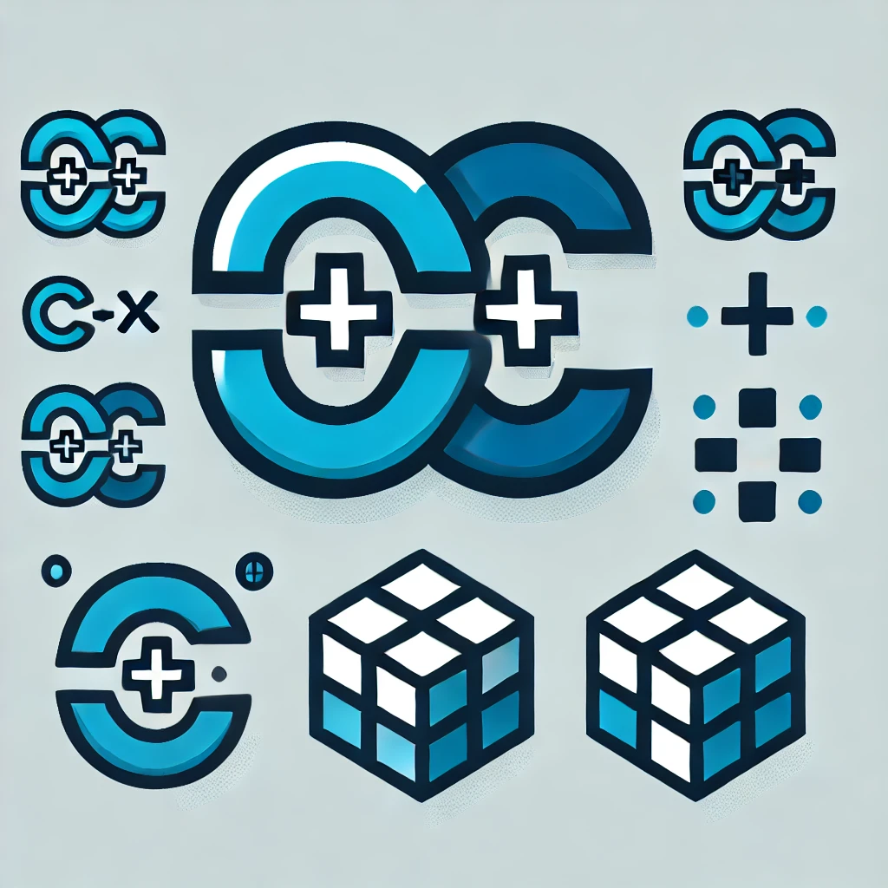

# C++ Trial

[](https://github.com/huangsam/cpp-trial/actions)

Coding in C++ to explore tools like [CMake](https://cmake.org/) and [GoogleTest](https://google.github.io/googletest/).



## Getting started

```shell
# Install developer tools
make setup

# Run main binary and test binary
make all
```

For contributors, please run `make format` and `make lint` before creating a PR.

## Helpful resources

- <https://cplusplus.com/>
- <https://en.cppreference.com/w/>
- <https://google.github.io/styleguide/cppguide.html>
- <https://google.github.io/googletest/reference/assertions.html>
- <https://cmake.org/cmake/help/git-master/manual/cmake-commands.7.html>
- <https://github.com/fffaraz/awesome-cpp>
- <https://github.com/oz123/awesome-c>
