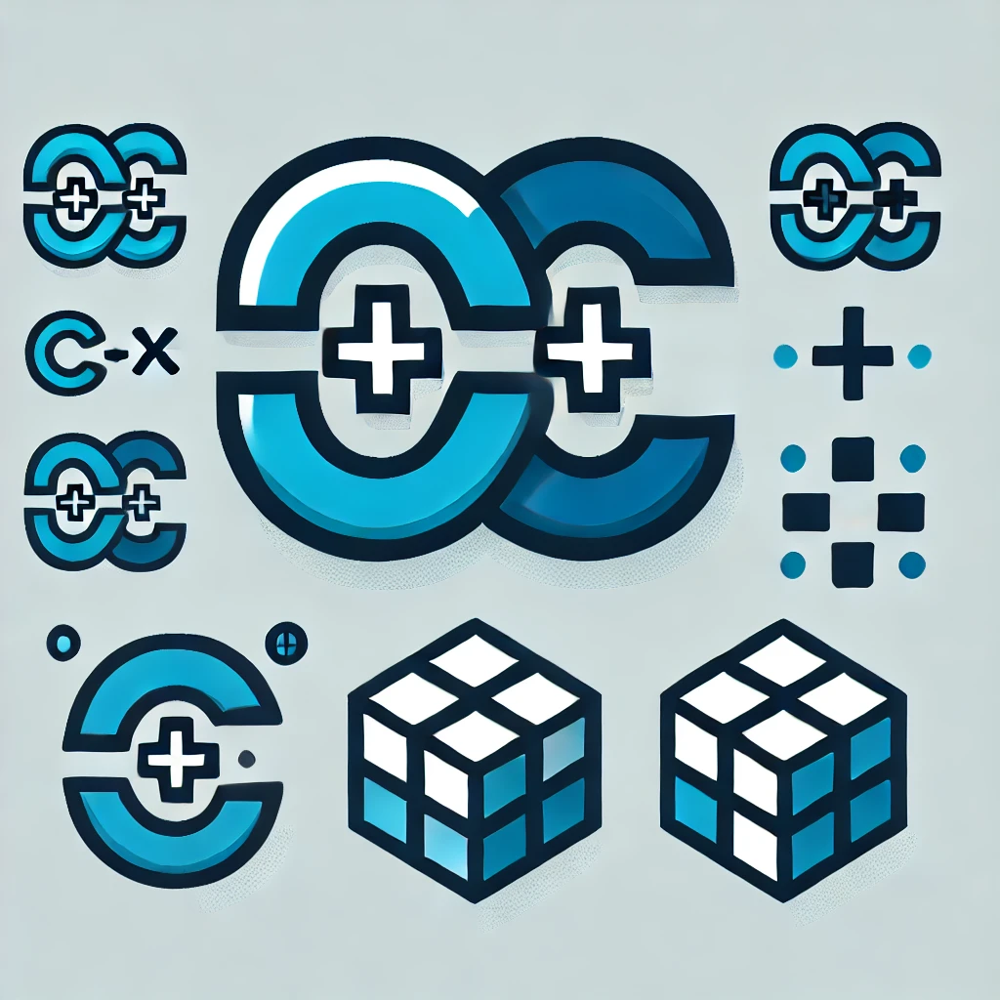

# C++ Trial

[](https://github.com/huangsam/cpp-trial/actions)

Exploring modern C++ concepts (C++11 to C++20) with [CMake](https://cmake.org/) and [GoogleTest](https://google.github.io/googletest/) as development tools.



## Project goals

This repository serves as a comprehensive learning resource for modern C++ development, focusing on language mastery through C++11 to C++20 features, tool proficiency with CMake and GoogleTest, backend development patterns for systems programming, code quality with clean and testable C++ code, and progressive learning from basic concepts to advanced template metaprogramming.

## Project structure

The core codebase is organized into domain-specific modules in [`src/`](src/README.md):
- [`oop/`](src/oop/README.md): Core class design, value encapsulation, inheritance, and runtime polymorphism.
- [`types/`](src/types/README.md): Type safety, namespaces, enums, unions, and modern vocabulary types.
- [`stl/`](src/stl/README.md): Standard Template Library containers, algorithms, ranges, and file I/O.
- [`memory/`](src/memory/README.md): Smart pointers, move semantics, and custom memory management.
- [`advanced/`](src/advanced/README.md): Metaprogramming, concepts, lambdas, and factorial templates.
- [`concurrency/`](src/concurrency/README.md): Threading, async programming, and synchronization structures.

For a guided, progressive learning path across these concepts, refer to [LESSONS.md](LESSONS.md).

## Getting started

```shell
# Build and run unit tests
cmake --preset dev && cmake --build --preset dev && ctest --test-dir build --output-on-failure

# Run demo application
./build/bin/main.out

# Run benchmarks (release mode)
cmake --preset release && cmake --build --preset release
./build/bin/bench/memory_bench.out
```

## Useful resources

- <https://cplusplus.com/>
- <https://en.cppreference.com/w/>
- <https://google.github.io/styleguide/cppguide.html>
- <https://google.github.io/googletest/reference/assertions.html>
- <https://cmake.org/cmake/help/git-master/manual/cmake-commands.7.html>
- <https://clang.llvm.org/docs/ClangFormatStyleOptions.html>
- <https://clang.llvm.org/extra/clang-tidy/checks/list.html>
- <https://github.com/fffaraz/awesome-cpp>
